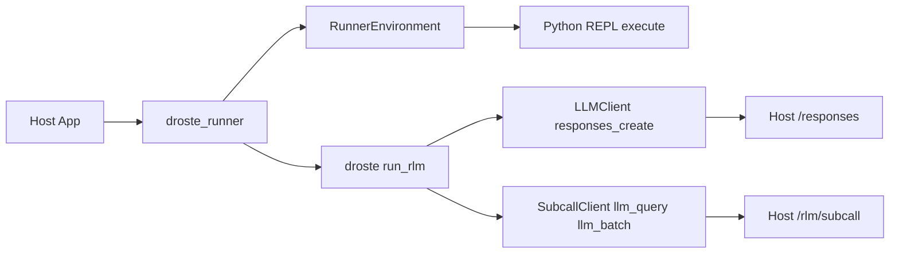

<picture>
  <source media="(prefers-color-scheme: dark)" srcset="docs/assets/droste-dark.svg">
  
</picture>

# Droste

**A recursive analysis engine for data too large for a context window.**

Droste implements the Recursive Language Model (RLM) technique. Rather than
placing an entire corpus in the root model's context, it exposes the corpus
through a sandboxed Python REPL. The model writes programs over that data and
delegates bounded semantic judgments through `llm_query` and
`llm_query_batched`.

```bash
uvx droste "which customer had a failed charge, and why?" server.log
uvx droste "which plan has the highest refund rate vs its MRR?" shop.db
uvx droste "how do the authentication flows differ?" ./docs
```


The first example runs against a 444 kB log:

```
$ droste "Which customer had a failed charge, for what amount, and why?
  How many timeout errors are there, and which upstream do they blame?" server.log

1. **Failed Charge Details**:
   - **Customer**: `cus_9982`
   - **Amount**: 1499 (USD, which is $14.99)
   - **Reason**: The card was declined due to insufficient funds
     (`reason=card_declined decline_code=insufficient_funds`).

2. **Timeout Errors**:
   - **Count**: There are exactly 66 timeout errors in the log.
   - **Upstream blamed**: They blame `payments-v2` (`upstream=payments-v2`).
```

The counts are exact because the model *counted them in Python* — it never
read 3,400 log lines through its attention. In `--db` mode the model
introspects your schema, writes read-only SQL, and computes over the rows;
in the demo above it noticed the free plan makes refund-rate-vs-MRR
undefined and answered for the paid plans instead.

## How it works

Mechanical work stays mechanical: regex and SQL find *where*, model subcalls
interpret *what*, and code combines the results. The root model can inspect
the shape of the corpus, narrow it without model calls, and fan out only when
a step requires semantic judgment.

This is a different data path from a general coding or tool agent. Agents
choose actions across open-ended tasks, and every observation they make —
file reads, search results, subagent reports — returns through the model's
conversation context. Droste has a narrower job: the corpus lives as a
variable in the REPL, the model sees only what its code chooses to print, and
selected slices go to bounded subcalls instead of accumulating in the
transcript. Code locates and aggregates; subcalls interpret bounded inputs;
the root model assembles the answer.

Execution is bounded by explicit iteration, subcall, and output limits. Root
and subcall models can be configured independently. These controls make the
work observable and limitable; they are not a promise of a particular answer
quality, latency, or price, which depend on the data, models, and endpoint.

## When to reach for it

Each of these follows from the mechanism above, not from benchmark claims:

- **Exact answers over large mechanical data.** Counts, aggregates, and joins
  over logs, exports, or SQLite — where attention over thousands of lines
  approximates, but `len()` and `GROUP BY` do not.
- **Semantic judgment at scale.** "Classify/judge each of these N records":
  code selects the slices, `llm_query_batched` fans out bounded subcalls,
  and code tallies the results. The full corpus does not have to pass
  through the root model's context window.
- **Mixed questions.** Answers that need exact computation *and* actual
  reading — "which plan has the highest refund rate, and what do those
  customers complain about?" — the case neither pure SQL nor pure
  long-context reading handles alone.
- **Embedding a bounded question-answering primitive.** Product features that
  answer questions over user data behind hard compute budgets and audit
  traces. Generated code gets no open-ended tool selection — only the data
  bindings the host configures — though execution isolation remains the
  host's job (see [Embed it](#embed-it)).

When the data fits comfortably in a context window, or the task is
open-ended multi-step work rather than a question with an answer, use a
general agent — droste is deliberately not one. Three worked starting points
live in [docs/recipes.md](docs/recipes.md) (logs, chat archives, SQLite).

## Use it

Ask questions over files, folders, and SQLite from the terminal. The
contract: **args that exist are data, the one that doesn't is the question,
no args means the current directory, pipes are data too — and it always
prints one line saying what it read.**

```bash
uvx droste "…" ./docs        # zero-install, npx-style
uv tool install droste       # or keep the binary around
pipx install droste          # the older equivalent
```

```bash
droste login                 # one-time setup: free credits, or your own key
droste "what changed between these?" report.txt logs.txt
droste "which customers churned last month?" app.db
droste "how does auth work here?" ./docs
cd ~/notes && droste "what did I decide about pricing?"
tail -5000 app.log | droste "why did it crash?"
```

SQLite files are recognized by their magic bytes — no flag needed (`--db`
remains as an explicit override). Directory walks skip binaries, dotfiles,
and the usual junk (`.git`, `node_modules`, …) and cap sizes
(`--max-file-bytes`, `--max-bytes`); every skip is counted in the report
line. `droste ask …` still works as an alias.

Files are materialized as the sandbox's `context` variable — the model is
told each file's name and size (not its contents) and pulls data in via
code, so multi-MB files are fine. What the model reads is whatever its code
chooses to print. `--db` uses the engine's local-mode SQL data source (read-only
policy as a guardrail, not a boundary; OS permissions are the boundary).

Engine knobs mirror `RLMConfig`: `--subcall-model`,
`--subcall-max-output-tokens` (default 2048), `--reasoning-effort`,
`--max-iterations`, `--max-subcalls`. `--json` prints a result object for
scripting; `--verbose` streams one-line progress to stderr (watch it think);
`--trace` renders the full structured event stream — generated code, execution
output with per-iteration sub-call counts and answer state, LLM responses,
execution errors. Exit code 0 means a confirmed (or extracted-with-note)
answer.

Droste is the open execution engine. Compatible hosted gateways and control
planes can add authentication, server-enforced policy and cost limits, and
audit around it; those services are integrations, not part of the engine.
Use `--base-url` to select a compatible endpoint.

## Embed it

The same wheel is the engine as a library — zero runtime dependencies,
`urllib`-only. Add it to your app and point the loop at your own data
sources:

```bash
uv add droste        # or: pip install droste
```

Using is asking over *your* data; embedding is building RLM answers into a
product for *your users*.

### BYOK: compatible endpoints

The engine includes an OpenAI-compatible client and an Anthropic Messages
client. Configure the corresponding API key and model identifier; an explicit
base URL selects a compatible endpoint. Bring your own key — no hosted account
required. The CLI detects the protocol from credential and endpoint
configuration, and an explicit `--base-url`/`OPENAI_BASE_URL` always wins.

```bash
export ANTHROPIC_API_KEY=sk-ant-...
droste "why did it crash?" ./logs --model claude-opus-4-8
```

```python
from droste import (
    Budget,
    EnvironmentConfig,
    OpenAICompatClient,
    OpenAICompatSubcallClient,
    SandboxLimits,
    create_environment,
    create_environment_context,
    run_rlm,
)

environment_config = EnvironmentConfig(
    kind="native",
    budget=Budget(subcalls=50, depth=1),
    sandbox=SandboxLimits(output_chars=25_000),
)
context = create_environment_context(environment_config)
root = OpenAICompatClient(model="gpt-5.2-mini")  # OPENAI_API_KEY / OPENAI_BASE_URL from env
subcalls = OpenAICompatSubcallClient(
    model="gpt-5.2-mini",
    context=context,               # shared call/token accounting
    max_output_tokens=2048,        # per-subcall output bound (cost control)
)

env = create_environment(
    environment_config,
    context=data,
    registry=registry,
    subcalls=subcalls,
    execution_context=context,
)
result = run_rlm(question, environment=env, root_llm=root, subcalls=subcalls, context=context)
```

Explicit `base_url=` / `api_key=` constructor args win over the environment
variables. Subcall batches use the immutable rollout concurrency (default 5),
and every subcall's usage block is added to `result.tokens_used`. When choosing
a non-default value in-process, pass the same value as the built-in subcall
client's `max_parallel` and `RolloutConfiguration.concurrency`; a mismatch
fails before inference.

`reasoning_effort` and `extra_body` pass through to the endpoint as-is.
Disabling thinking per-subcall is a gateway capability: a compatible gateway
may enforce it server-side, while raw endpoints may ignore a client-side
disable.

### Runner architecture (droste_runner)

The `droste_runner` package is a thin orchestration layer that wires `droste` to
HTTP-backed root LLM calls and subcalls. It is shared across hosted and
in-process embedders so the loop logic stays in one place. For custom environments,
set `adapter_module` in the runner request to delegate to an adapter module's
`run(request)` function.



**Runner inputs**

- `protocol_version`: **required** on every request (currently `6`) — a
  missing or mismatched version gets a structured refusal, so hosts detect
  incompatibility instead of failing on a missing field.
- `budget`: **required** complete six-field compute authorization object.
- `root_endpoint` + `subcall_endpoint` + `token`: required for HTTP-backed
  runs.
- `operation`: `run` (default) or `preflight`; preflight resolves and checks
  the content-free scaffold without model/provider calls or endpoint
  credentials.
- Optional: `subcall_concurrency` (default `5`), `root_reasoning_effort`
  (sent unchanged on every root callback), `adapter_module` (delegate the
  runner to a custom module's `run(request)`).

Refusal envelopes, operation semantics, and the compatibility window live in
[docs/architecture.md](docs/architecture.md) ("The runner protocol");
per-release embedder migration notes are in [UPGRADING.md](UPGRADING.md).

### Core concepts

Implement these protocols to integrate with your infrastructure:

- **`RLMEnvironment`** - Sandboxed Python REPL with data access
- **`LLMClient`** - Chat completion interface for the root LLM
- **`SubcallClient`** - Provides `llm_query()` and `llm_batch()` for sub-LLM calls
- **`SubcallOutputTokenLimitProvider`** - Optional companion protocol exposing a
  read-only `output_token_limit`: a positive per-call token ceiling or `None`
  when deliberately unbounded. Clients that omit it remain compatible and are
  reported to the root model as having an unknown limit.
- **`ProviderManifest`** - Immutable data-operation metadata

Data access is descriptor-driven: a reusable `ProviderManifest` declares each
provider's operations, schemas, and pagination; a host binds it with its own
side-effect classifications and policy through an explicit `ProviderCatalog`.
The bundled local providers are SQLite and `filesystem_text` (bounded
`list_files`, `read`, literal `grep`, index-free `search`, and `stat` over an
explicitly configured directory). Trusted hosts may also acquire MCP servers
as the same provider abstraction; generated code still receives only
descriptor-generated broker bindings. See
[Provider manifests](docs/provider-manifests.md) for the value model and
ownership boundaries, plus the [local stdio](docs/mcp-stdio.md) and
[Streamable HTTP](docs/mcp-http.md) MCP transport contracts.

Every run emits a strict, versioned structured event stream — the
[Trace ABI](docs/trace-abi.md) gives each event one run identity, sequence,
and retention class. Retaining replay content and authorizing training use
are separate, default-denied decisions. The wheel includes the exact
cross-runtime conformance corpus for embedders.

### Configuration

```python
RLMConfig(
    budget=Budget(
        tokens=500_000,
        subcalls=50,
        depth=1,
        wall_ms=300_000,
        root_output_tokens=4_096,
        subcall_output_tokens=2_048,
    ),
    sandbox=SandboxLimits(output_chars=25_000),
    prompt_profile="full",  # Versioned prompt-pack profile (full/minimal/none)
    policy_hints=PolicyHints(semantic=True), # Optional explicit contract
)
```

Compute authorization is one immutable vector, reconciled by one run-scoped
ledger. See [Budgets](docs/budgets.md). Sandbox output and execution guardrails
are separate because they describe the local REPL, not model/provider spend.

Harness prompts resolve once per run from immutable, versioned data. See
[Prompt packs](docs/prompt-packs.md) for the stable five-slot contract, custom
pack loading, deterministic fallback order, and provenance records.

Droste does not infer semantic intent from the question. When a caller supplies
`PolicyHints(semantic=True)`, at least one semantic subcall must succeed and any
incomplete `llm_batch_json` result blocks confirmation. Only an error-free
repeat with the exact prompts, contexts, schema, and validator object resolves
that partial evidence. Omit the hint to retain purely prompt-driven behavior.

### Result

```python
RLMResult(
    answer="...",           # Final answer from answer["content"]
    ready=True,             # Whether answer["ready"] was set
    iterations=3,           # Iterations used
    tokens_used=1500,       # Total tokens consumed
    sub_calls_made=12,      # Total llm_query/llm_batch calls
    trajectory=[...],       # Full execution history
    extracted=False,        # True if the answer came from the post-exhaustion
                            # extract pass (best-effort, not confirmed)
    prompt_pack=...,        # Frozen resolved pack identity + provenance
)
```

## Benchmarks

The repository ships a [versioned benchmark harness](benchmarks/README.md):
immutable per-task artifacts, deterministic scorers, and reports that
regenerate byte-for-byte from committed evidence, offline.

### OOLONG `trec_coarse`

The published OOLONG result is a slice from the
[RLM paper suite](benchmarks/manifests/rlm-paper-v1.json): 131K-token
contexts, 50 tasks, three arms, one repetition, run 2026-07-17
([report](benchmarks/results/oolong-trec-coarse-131k-2026-07-17/report.md) ·
[raw artifacts](benchmarks/results/oolong-trec-coarse-131k-2026-07-17/artifacts)).

| Arm | Root model | Subcall model | Mean score | Cost | Tokens |
|---|---|---|---:|---:|---:|
| direct-sol | gpt-5.6-sol | — | 0.6020 | $26.175585 | 4,763,877 |
| direct-terra | gpt-5.6-terra | — | 0.5668 | $12.471453 | 4,722,032 |
| droste-terra-luna | gpt-5.6-terra | gpt-5.6-luna | 0.6432 | $10.158295 | 3,531,293 |

The direct arms place the full context in a single model call. The droste arm
runs this engine with a mid-tier root model delegating to a cheaper subcall
model (root reasoning `medium`, subcall reasoning `none`). All 150 task–arm
runs completed; a failure or timeout would be retained as a typed artifact,
not dropped. All arms ran through the same OpenAI-compatible endpoint
(ModelRelay); costs are measured in integer micro-USD against the price
snapshot recorded with the run. The `oolong_official` scorer
([benchmarks/scoring.py](benchmarks/scoring.py)) implements the benchmark's
published rule — exact, comparison-phrase, and date matches score 1.0, and
numeric answers earn graded credit of 0.75^|error| — so the mean score is
graded, not plain accuracy.

droste-terra-luna scored highest of the three arms — 0.6432, against 0.6020
for direct-sol and 0.5668 for direct-terra — while costing about 2.6× less
than the stronger direct baseline and using fewer total tokens. With one
50-task repetition, a paired bootstrap over the per-task scores in the
committed artifacts does not separate the three mean scores at 95%
confidence, so treat the score ranking as this run's observed result rather
than a statistically established ranking; the cost figure is a direct
measurement, not a sampled statistic, and isn't subject to that caveat.
Run-to-run variation comes from provider sampling (temperature is
not pinned; the endpoint default applies), from possible server-side model
changes behind pinned model ids, and from trajectory variance in the droste
arm. Per-arm prompts are fixed harness prompts committed in
[benchmarks/live.py](benchmarks/live.py), including benchmark-specific
guidance for the droste arm; budgets, limits, and concurrency are pinned in
the [manifest](benchmarks/manifests/rlm-paper-v1.json).

The task slice is materialized from the public dataset
([oolongbench/oolong-synth](https://huggingface.co/datasets/oolongbench/oolong-synth),
pinned revision `f0d59ea`, validation rows 1050–1099) with SHA-256
verification. The dataset card at that revision does not state a license, so
the tasks themselves are not redistributed here; the committed artifacts
contain only per-task predictions, gold labels, scores, and usage.
[benchmarks/README.md](benchmarks/README.md) has the offline
report-regeneration command, the materialization command, and the live-run
procedure (new output directory, immutable artifacts, explicit cost cap).

### S-NIAH

The adjacent S-NIAH result is the single needle-in-a-haystack retrieval task
from the RULER methodology of
[Hsieh et al. (2024)](https://arxiv.org/abs/2404.06654). This
run used 32,768-token noise haystacks, word-pair keys and values, seed `42`, 50
tasks, three arms, and one repetition on 2026-07-17
([report](benchmarks/results/sniah-32k-2026-07-17/report.md) ·
[raw artifacts](benchmarks/results/sniah-32k-2026-07-17/artifacts) ·
[generator provenance](benchmarks/results/sniah-32k-2026-07-17/provenance/generator.json)).

| Arm | Root model | Subcall model | Exact-match accuracy | Cost | Tokens |
|---|---|---|---:|---:|---:|
| direct-sol-sniah | gpt-5.6-sol | — | 84% | $7.791160 | 1,556,242 |
| direct-terra-sniah | gpt-5.6-terra | — | 100% | $3.895694 | 1,556,249 |
| droste-terra-luna-sniah | gpt-5.6-terra | gpt-5.6-luna | 100% | $0.659419 | 190,253 |

The direct arms place the complete prompt in one model call. The droste arm
runs this engine with a `gpt-5.6-terra` root delegating to `gpt-5.6-luna`
subcalls (root reasoning `medium`, subcall reasoning `none`). All 150 task-arm
runs completed; failures and timeouts would remain typed artifacts rather than
being dropped. Costs are measured in integer micro-USD from the price snapshot
used by each run.

This benchmark is Droste's deterministic reproduction of RULER's published
algorithm and prompt methodology, checked against NVIDIA/RULER commit
[`38da79d79519ef87aa46ae804f838e1eab7f86d7`](https://github.com/NVIDIA/RULER/tree/38da79d79519ef87aa46ae804f838e1eab7f86d7).
The generator is [committed in this repository](benchmarks/sniah.py); it fetches
and redistributes no dataset or generated examples. There is consequently no
external dataset revision, dataset citation, or dataset-license section for
this result. The provenance record instead pins the generator hash, seed,
configuration, materialized-task hash, and RULER commit.

### LongBench-v2 CodeQA

This published result is code-repository-understanding multiple-choice QA over
real long-context codebases. The run used 20 tasks, three arms, and one
repetition on 2026-07-17
([report](benchmarks/results/longbench-v2-codeqa-20-2026-07-17/report.md) ·
[raw artifacts](benchmarks/results/longbench-v2-codeqa-20-2026-07-17/artifacts) ·
[provenance](benchmarks/results/longbench-v2-codeqa-20-2026-07-17/PROVENANCE.md)).

| Arm | Root model | Subcall model | Mean score | Successful | Cost | Tokens |
|---|---|---|---:|---:|---:|---:|
| direct-sol | gpt-5.6-sol | — | 0.7500 | 18/20 | $19.597640 | 3,910,423 |
| direct-terra | gpt-5.6-terra | — | 0.6500 | 17/20 | $9.096737 | 3,627,983 |
| droste-terra-luna | gpt-5.6-terra | gpt-5.6-luna | 0.6500 | 20/20 | $3.793057 | 1,348,775 |

The direct arms place the complete codebase context in one model call. The
droste arm runs this engine with a `gpt-5.6-terra` root delegating to
`gpt-5.6-luna` subcalls (root reasoning `medium`, subcall reasoning `none`).
All 60 scheduled task–arm attempts remain in the committed artifacts, including
the two unsuccessful direct-sol attempts and three unsuccessful direct-terra
attempts. Costs are measured in integer micro-USD from the price snapshot used
by each run.

droste-terra-luna tied direct-terra's 0.6500 mean score and trailed direct-sol's
0.7500 by 10 percentage points, while costing 2.4× less than direct-terra and
5.2× less than direct-sol. This is a mixed, cost-favorable result, not a clean
sweep. With one 20-task sample, the two-task score difference from direct-sol
is the observed result, not evidence of a population-level separation.

In [*Recursive Language Models* (Zhang, Kraska, and Khattab, 2025;
arXiv:2512.24601)](https://arxiv.org/abs/2512.24601), Table 1 evaluates CodeQA
across the full 23K–4.2M-token range: its GPT-5 direct baseline, with no
fine-tuning, scores 24.0%, far below this capped sample's 75.0% direct-sol
score, and several CodeQA entries are flagged for partial context-limit
failures. The contrast shows that this cost-bounded sample tests an easier
regime than the scale where the paper demonstrates the clearest gap between
direct and recursive approaches; this result therefore likely understates,
rather than contradicts, RLM's advantage on CodeQA-style tasks at the scale the
paper evaluates. [Issue #172](https://github.com/tensor-systems/droste/issues/172)
tracks a full-domain, larger-scale run once funded.

The tasks come from
[`zai-org/LongBench-v2`](https://huggingface.co/datasets/zai-org/LongBench-v2/tree/2b48e494f2c7a2f0af81aae178e05c7e1dde0fe9),
Apache-2.0, at pinned revision
`2b48e494f2c7a2f0af81aae178e05c7e1dde0fe9`, filtered to the 50-task
`Code Repository Understanding` domain. The published run is explicitly a
disclosed, cost-bounded 20-of-50 stratified subsample, not the complete domain:
8 short, 7 medium, and 5 long tasks, comprising 8 easy and 12 hard tasks. The
full-domain cost was disproportionate for this run—one pilot task alone cost
$3.30—so the harness fixes centered, evenly spaced selections within each
length/difficulty stratum before model outcomes are observed. The
[materializer](benchmarks/longbench_codeqa.py), manifest task hash, selection
rule, and offline report-regeneration command are public.


### OOLONG-Pairs

OOLONG-Pairs tests multi-hop pairwise reasoning over OOLONG-style
synthetic conversations: find every pair of users satisfying a relational
predicate, scored with set-based F1 over normalized, deduplicated pairs. The
run used one 32,768-token context, 20 tasks, three arms, and one repetition on
2026-07-17
([report](benchmarks/results/oolong-pairs-32k-2026-07-17/report.md) ·
[raw artifacts](benchmarks/results/oolong-pairs-32k-2026-07-17/artifacts) ·
[provenance](benchmarks/results/oolong-pairs-32k-2026-07-17/PROVENANCE.md)).

| Arm | Root model | Subcall model | Mean F1 | Successful | Cost | Tokens |
|---|---|---|---:|---:|---:|---:|
| direct-sol-pairs | gpt-5.6-sol | — | 0.000000 | 0/20 | $0.000000 | 0 |
| direct-terra-pairs | gpt-5.6-terra | — | 0.034057 | 14/20 | $2.497269 | 435,842 |
| droste-terra-luna-pairs | gpt-5.6-terra | gpt-5.6-luna | 0.801724 | 20/20 | $2.141592 | 767,642 |

The direct arms place the complete context in one model call. The Droste arm
uses a `gpt-5.6-terra` root with `gpt-5.6-luna` subcalls (root reasoning
`medium`, subcall reasoning `none`). Its design is deliberately hybrid:
deterministic Python parses and aggregates the records and exhaustively
enumerates user pairs, while Luna handles only the irreducible semantic
classification step. All 60 scheduled attempts remain in the committed
artifacts, including failures. Costs are measured in integer micro-USD from
the recorded model usage.

This is Droste's strongest result across the four benchmark families evaluated
under [#166](https://github.com/tensor-systems/droste/issues/166). Direct-sol
could not complete a single task: all 20 attempts ended in legitimate HTTP 504
timeouts. Direct-terra completed 14/20, with six further 504 timeouts, but its
mean F1 of 0.034 was near zero—it essentially failed at the pairwise reasoning.
Droste completed all 20 tasks at 0.802 mean F1 for $2.14, less than
direct-terra's $2.50 despite succeeding on every task. No attempt recorded a
402 or 429. Exhaustive multi-hop reasoning over facts scattered across a long
context is where the paper's thesis about direct approaches structurally
failing is clearest in these runs.

The tasks are materialized from
[`oolongbench/oolong-synth`](https://huggingface.co/datasets/oolongbench/oolong-synth/tree/f0d59eaf0febf130664cfceb710436c8e3216b2b),
validation `trec_coarse` context-window row 900, at pinned revision
`f0d59eaf0febf130664cfceb710436c8e3216b2b`. The manifest pins the materialized
20-task file at SHA-256
`169a2aaddc8603128f672d32f9aa8a2e0565974d91b6468b7431654dd81bde40`.
The materializer documents the predicate semantics, and the scorer normalizes
unordered pairs before computing set precision, recall, and F1. The dataset
card at the pinned revision does not state a license, so dataset contexts and
tasks are not redistributed here.

This is a clean result, but its disclosed scope is small: `n=20`, with one
repetition. It establishes the outcome of this paired run rather than a
population-wide guarantee.

The remaining suite families are `planned` and cannot run until their sources
are pinned. A zero-cost smoke run checks the artifact and reporting path
without making network calls:

```bash
output="$(mktemp -d)/droste-benchmark-smoke"
uv run python -m benchmarks smoke --output "$output"
```

The smoke run validates the machinery, not model quality.

## Development

```bash
uv sync --extra verifiers  # Install the full test surface when supported
uv run pytest              # Verifiers tests skip when its extra is unavailable
uv build                   # Build wheel
```

## The name

The [Droste effect](https://en.wikipedia.org/wiki/Droste_effect) is the
picture that contains itself. M.C. Escher's *Print Gallery* pushed it to its
limit — a man in a gallery viewing a print that contains the gallery he is
standing in — and Escher left the center of the spiral famously blank,
signed but uncompleted, where the recursion outran his hand. Fifty years
later, mathematicians completed it; their project was titled *"The
Mathematics Behind the Droste Effect."*

The answer at the center of the spiral — the part the picture couldn't hold
— is what recursion computes.

## License

Apache-2.0. See [LICENSE](LICENSE). Contributions welcome —
[CONTRIBUTING.md](CONTRIBUTING.md). Versioning is semver; the runner
protocol and source-registry contract carry an explicit compatibility
window (see [docs/architecture.md](docs/architecture.md)).
