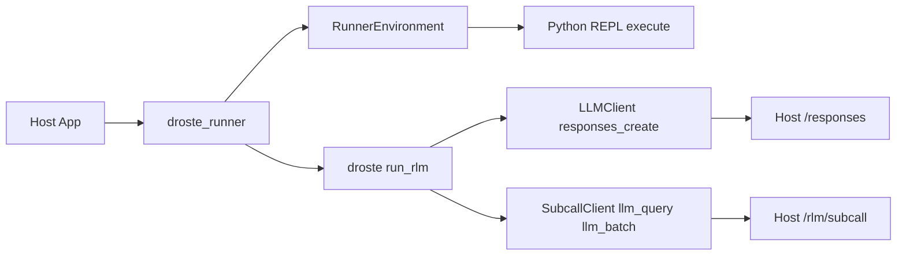

<picture>
  <source media="(prefers-color-scheme: dark)" srcset="docs/assets/droste-dark.svg">
  
</picture>

# Droste

**A recursive analysis engine for data too large for a context window.**

Droste implements the Recursive Language Model (RLM) technique. Rather than
placing an entire corpus in the root model's context, it exposes the corpus
through a sandboxed Python REPL. The model writes programs over that data and
delegates bounded semantic judgments through `llm_query` and
`llm_query_batched`.

```bash
uvx droste "which customer had a failed charge, and why?" server.log
uvx droste "which plan has the highest refund rate vs its MRR?" shop.db
uvx droste "how do the authentication flows differ?" ./docs
```


The first example runs against a 444 kB log:

```
$ droste "Which customer had a failed charge, for what amount, and why?
  How many timeout errors are there, and which upstream do they blame?" server.log

1. **Failed Charge Details**:
   - **Customer**: `cus_9982`
   - **Amount**: 1499 (USD, which is $14.99)
   - **Reason**: The card was declined due to insufficient funds
     (`reason=card_declined decline_code=insufficient_funds`).

2. **Timeout Errors**:
   - **Count**: There are exactly 66 timeout errors in the log.
   - **Upstream blamed**: They blame `payments-v2` (`upstream=payments-v2`).
```

The counts are exact because the model *counted them in Python* — it never
read 3,400 log lines through its attention. In `--db` mode the model
introspects your schema, writes read-only SQL, and computes over the rows;
in the demo above it noticed the free plan makes refund-rate-vs-MRR
undefined and answered for the paid plans instead.

## How it works

Mechanical work stays mechanical: regex and SQL find *where*, model subcalls
interpret *what*, and code combines the results. The root model can inspect
the shape of the corpus, narrow it without model calls, and fan out only when
a step requires semantic judgment.

This is a different data path from a general coding or tool agent. Agents
choose actions across open-ended tasks, and every observation they make —
file reads, search results, subagent reports — returns through the model's
conversation context. Droste has a narrower job: the corpus lives as a
variable in the REPL, the model sees only what its code chooses to print, and
selected slices go to bounded subcalls instead of accumulating in the
transcript. Code locates and aggregates; subcalls interpret bounded inputs;
the root model assembles the answer.

Execution is bounded by explicit iteration, subcall, and output limits. Root
and subcall models can be configured independently. These controls make the
work observable and limitable; they are not a promise of a particular answer
quality, latency, or price, which depend on the data, models, and endpoint.

## When to reach for it

Each of these follows from the mechanism above, not from benchmark claims:

- **Exact answers over large mechanical data.** Counts, aggregates, and joins
  over logs, exports, or SQLite — where attention over thousands of lines
  approximates, but `len()` and `GROUP BY` do not.
- **Semantic judgment at scale.** "Classify/judge each of these N records":
  code selects the slices, `llm_query_batched` fans out bounded subcalls,
  and code tallies the results. The full corpus does not have to pass
  through the root model's context window.
- **Mixed questions.** Answers that need exact computation *and* actual
  reading — "which plan has the highest refund rate, and what do those
  customers complain about?" — the case neither pure SQL nor pure
  long-context reading handles alone.
- **Embedding a bounded question-answering primitive.** Product features that
  answer questions over user data behind hard compute budgets and audit
  traces. Generated code gets no open-ended tool selection — only the data
  bindings the host configures — though execution isolation remains the
  host's job (see [Embed it](#embed-it)).

When the data fits comfortably in a context window, or the task is
open-ended multi-step work rather than a question with an answer, use a
general agent — droste is deliberately not one. Three worked starting points
live in [docs/recipes.md](docs/recipes.md) (logs, chat archives, SQLite).

## Use it

Ask questions over files, folders, and SQLite from the terminal. The
contract: **args that exist are data, the one that doesn't is the question,
no args means the current directory, pipes are data too — and it always
prints one line saying what it read.**

```bash
uvx droste "…" ./docs        # zero-install, npx-style
uv tool install droste       # or keep the binary around
pipx install droste          # the older equivalent
```

```bash
droste login                 # one-time setup: free credits, or your own key
droste "what changed between these?" report.txt logs.txt
droste "which customers churned last month?" app.db
droste "how does auth work here?" ./docs
cd ~/notes && droste "what did I decide about pricing?"
tail -5000 app.log | droste "why did it crash?"
```

SQLite files are recognized by their magic bytes — no flag needed (`--db`
remains as an explicit override). Directory walks skip binaries, dotfiles,
and the usual junk (`.git`, `node_modules`, …) and cap sizes
(`--max-file-bytes`, `--max-bytes`); every skip is counted in the report
line. `droste ask …` still works as an alias.

Files are materialized as the sandbox's `context` variable — the model is
told each file's name and size (not its contents) and pulls data in via
code, so multi-MB files are fine. What the model reads is whatever its code
chooses to print. `--db` uses the engine's local-mode SQL data source (read-only
policy as a guardrail, not a boundary; OS permissions are the boundary).

Engine knobs mirror `RLMConfig`: `--subcall-model`,
`--subcall-max-output-tokens` (default 2048), `--reasoning-effort`,
`--max-iterations`, `--max-subcalls`. `--json` prints a result object for
scripting; `--verbose` streams one-line progress to stderr (watch it think);
`--trace` renders the full structured event stream — generated code, execution
output with per-iteration sub-call counts and answer state, LLM responses,
execution errors. Exit code 0 means a confirmed (or extracted-with-note)
answer.

Droste is the open execution engine. Compatible hosted gateways and control
planes can add authentication, server-enforced policy and cost limits, and
audit around it; those services are integrations, not part of the engine.
Use `--base-url` to select a compatible endpoint.

## Embed it

The same wheel is the engine as a library — zero runtime dependencies,
`urllib`-only. Add it to your app and point the loop at your own data
sources:

```bash
uv add droste        # or: pip install droste
```

Using is asking over *your* data; embedding is building RLM answers into a
product for *your users*.

### BYOK: compatible endpoints

The engine includes an OpenAI-compatible client and an Anthropic Messages
client. Configure the corresponding API key and model identifier; an explicit
base URL selects a compatible endpoint. Bring your own key — no hosted account
required. The CLI detects the protocol from credential and endpoint
configuration, and an explicit `--base-url`/`OPENAI_BASE_URL` always wins.

```bash
export ANTHROPIC_API_KEY=sk-ant-...
droste "why did it crash?" ./logs --model claude-opus-4-8
```

```python
from droste import (
    Budget,
    EnvironmentConfig,
    OpenAICompatClient,
    OpenAICompatSubcallClient,
    SandboxLimits,
    create_environment,
    create_environment_context,
    run_rlm,
)

environment_config = EnvironmentConfig(
    kind="native",
    budget=Budget(subcalls=50, depth=1),
    sandbox=SandboxLimits(output_chars=25_000),
)
context = create_environment_context(environment_config)
root = OpenAICompatClient(model="gpt-5.2-mini")  # OPENAI_API_KEY / OPENAI_BASE_URL from env
subcalls = OpenAICompatSubcallClient(
    model="gpt-5.2-mini",
    context=context,               # shared call/token accounting
    max_output_tokens=2048,        # per-subcall output bound (cost control)
)

env = create_environment(
    environment_config,
    context=data,
    registry=registry,
    subcalls=subcalls,
    execution_context=context,
)
result = run_rlm(question, environment=env, root_llm=root, subcalls=subcalls, context=context)
```

Explicit `base_url=` / `api_key=` constructor args win over the environment
variables. Subcall batches use the immutable rollout concurrency (default 5),
and every subcall's usage block is added to `result.tokens_used`. When choosing
a non-default value in-process, pass the same value as the built-in subcall
client's `max_parallel` and `RolloutConfiguration.concurrency`; a mismatch
fails before inference.

`reasoning_effort` and `extra_body` pass through to the endpoint as-is.
Disabling thinking per-subcall is a gateway capability: a compatible gateway
may enforce it server-side, while raw endpoints may ignore a client-side
disable.

### Runner architecture (droste_runner)

The `droste_runner` package is a thin orchestration layer that wires `droste` to
HTTP-backed root LLM calls and subcalls. It is shared across hosted and
in-process embedders so the loop logic stays in one place. For custom environments,
set `adapter_module` in the runner request to delegate to an adapter module's
`run(request)` function.



**Runner inputs**

- `protocol_version`: **required** on every request (currently `6`) — a
  missing or mismatched version gets a structured refusal, so hosts detect
  incompatibility instead of failing on a missing field.
- `budget`: **required** complete six-field compute authorization object.
- `root_endpoint` + `subcall_endpoint` + `token`: required for HTTP-backed
  runs.
- `operation`: `run` (default) or `preflight`; preflight resolves and checks
  the content-free scaffold without model/provider calls or endpoint
  credentials.
- Optional: `subcall_concurrency` (default `5`), `root_reasoning_effort`
  (sent unchanged on every root callback), `adapter_module` (delegate the
  runner to a custom module's `run(request)`).

Refusal envelopes, operation semantics, and the compatibility window live in
[docs/architecture.md](docs/architecture.md) ("The runner protocol");
per-release embedder migration notes are in [UPGRADING.md](UPGRADING.md).

### Core concepts

Implement these protocols to integrate with your infrastructure:

- **`RLMEnvironment`** - Sandboxed Python REPL with data access
- **`LLMClient`** - Chat completion interface for the root LLM
- **`SubcallClient`** - Provides `llm_query()` and `llm_batch()` for sub-LLM calls
- **`SubcallOutputTokenLimitProvider`** - Optional companion protocol exposing a
  read-only `output_token_limit`: a positive per-call token ceiling or `None`
  when deliberately unbounded. Clients that omit it remain compatible and are
  reported to the root model as having an unknown limit.
- **`ProviderManifest`** - Immutable data-operation metadata

Data access is descriptor-driven: a reusable `ProviderManifest` declares each
provider's operations, schemas, and pagination; a host binds it with its own
side-effect classifications and policy through an explicit `ProviderCatalog`.
The bundled local providers are SQLite and `filesystem_text` (bounded
`list_files`, `read`, literal `grep`, index-free `search`, and `stat` over an
explicitly configured directory). Trusted hosts may also acquire MCP servers
as the same provider abstraction; generated code still receives only
descriptor-generated broker bindings. See
[Provider manifests](docs/provider-manifests.md) for the value model and
ownership boundaries, plus the [local stdio](docs/mcp-stdio.md) and
[Streamable HTTP](docs/mcp-http.md) MCP transport contracts.

Every run emits a strict, versioned structured event stream — the
[Trace ABI](docs/trace-abi.md) gives each event one run identity, sequence,
and retention class. Retaining replay content and authorizing training use
are separate, default-denied decisions. The wheel includes the exact
cross-runtime conformance corpus for embedders.

### Configuration

```python
RLMConfig(
    budget=Budget(
        tokens=500_000,
        subcalls=50,
        depth=1,
        wall_ms=300_000,
        root_output_tokens=4_096,
        subcall_output_tokens=2_048,
    ),
    sandbox=SandboxLimits(output_chars=25_000),
    prompt_profile="full",  # Versioned prompt-pack profile (full/minimal/none)
    policy_hints=PolicyHints(semantic=True), # Optional explicit contract
)
```

Compute authorization is one immutable vector, reconciled by one run-scoped
ledger. See [Budgets](docs/budgets.md). Sandbox output and execution guardrails
are separate because they describe the local REPL, not model/provider spend.

Harness prompts resolve once per run from immutable, versioned data. See
[Prompt packs](docs/prompt-packs.md) for the stable five-slot contract, custom
pack loading, deterministic fallback order, and provenance records.

Droste does not infer semantic intent from the question. When a caller supplies
`PolicyHints(semantic=True)`, at least one semantic subcall must succeed and any
incomplete `llm_batch_json` result blocks confirmation. Only an error-free
repeat with the exact prompts, contexts, schema, and validator object resolves
that partial evidence. Omit the hint to retain purely prompt-driven behavior.

### Result

```python
RLMResult(
    answer="...",           # Final answer from answer["content"]
    ready=True,             # Whether answer["ready"] was set
    iterations=3,           # Iterations used
    tokens_used=1500,       # Total tokens consumed
    sub_calls_made=12,      # Total llm_query/llm_batch calls
    trajectory=[...],       # Full execution history
    extracted=False,        # True if the answer came from the post-exhaustion
                            # extract pass (best-effort, not confirmed)
    prompt_pack=...,        # Frozen resolved pack identity + provenance
)
```

## Benchmarks

The repository ships a [versioned benchmark suite](benchmarks/README.md) with
per-task artifacts and offline reports. BrowseComp-Plus uses its official
model-judged semantic-equivalence methodology; the other reported scorers are
deterministic. Scores and measured costs below are from the published
2026-07-17 and 2026-07-18 runs; each result cell is score / cost.

| Benchmark | Scope | Direct Sol | Direct Terra | Droste Terra + Luna | Outcome |
|---|---|---:|---:|---:|---|
| [OOLONG](benchmarks/README.md#oolong-trec_coarse) | 131K tokens, 50 tasks | 0.6020 / $26.18 | 0.5668 / $12.47 | **0.6432 / $10.16** | Best score at 2.6× lower cost than the best direct arm |
| [S-NIAH](benchmarks/README.md#s-niah) | 32K tokens, 50 tasks | 0.84 / $7.79 | **1.00 / $3.90** | **1.00 / $0.66** | Ties best accuracy at 5.9× lower cost |
| [LongBench-v2 CodeQA](benchmarks/README.md#longbench-v2-codeqa) | Cost-bounded 20-of-50 sample | **0.75 / $19.60** | 0.65 / $9.10 | 0.65 / $3.79 | Mixed: ties Terra, trails Sol by 0.10, and costs 5.2× less than Sol[^codeqa] |
| [OOLONG-Pairs](benchmarks/README.md#oolong-pairs) | 32K tokens, 20 tasks | 0.00 / $0[^pairs-cost] | 0.034 / $2.50 | **0.80 / $2.14** | Strongest result: direct approaches structurally fail; Droste reaches 0.80 F1 at lower recorded cost |
| [BrowseComp-Plus](benchmarks/README.md#browsecomp-plus) | 6.0M–11.1M tokens, 150 tasks | N/A / $0[^browsecomp-direct] | N/A / $0[^browsecomp-direct] | **0.9400 / $24.54**[^browsecomp-judge] | Direct approaches cannot attempt the task at any cost; Droste completes 148/150 at 0.9400 judged accuracy |

[^codeqa]: CodeQA's published result is a disclosed, cost-bounded 20-of-50
    stratified subsample, not the complete domain. [Issue #172](https://github.com/tensor-systems/droste/issues/172)
    tracks a full-domain, larger-scale run.
[^pairs-cost]: Direct Sol's recorded $0 follows HTTP 504 failures that returned
    no billable usage to the harness; it is a measurement limit, not a zero-cost
    guarantee.
[^browsecomp-direct]: All direct attempts were rejected before generation
    because the 6.0M–11.1M-token inputs exceed the model context windows. N/A
    describes infeasibility; these are not substantive 0% accuracy results.
[^browsecomp-judge]: The primary 0.9400 is 141/150 under BrowseComp-Plus's
    canonical semantic-equivalence judge prompt, using `gpt-5.6-terra`. The
    deterministic exact-match secondary metric is 0.5600. The separate judge
    pass cost $0.292503; $24.54 is the Droste answer-generation cost shown in
    the table. See the [judge-augmented summary](benchmarks/results/browsecomp-plus-1k-2026-07-18/SUMMARY.md)
    and the separately [regenerable exact-match report](benchmarks/results/browsecomp-plus-1k-2026-07-18/report.md).

Across the published suite, Droste wins or ties on accuracy in all but CodeQA
and is dramatically more cost-efficient wherever a direct comparison can run.
Its clearest wins are on tasks that require aggregation across scattered
context (OOLONG and OOLONG-Pairs) and on BrowseComp-Plus, where the raw context
is 6–10× beyond any model window. On smaller lookup-shaped tasks (S-NIAH and
CodeQA), direct approaches with sufficient context remain competitive on
accuracy.

[Full results, methodology, provenance, and caveats for every published
family](benchmarks/README.md#results) are documented in the benchmark guide.

## Development

```bash
uv sync --extra verifiers  # Install the full test surface when supported
uv run pytest              # Verifiers tests skip when its extra is unavailable
uv build                   # Build wheel
```

## The name

The [Droste effect](https://en.wikipedia.org/wiki/Droste_effect) is the
picture that contains itself. M.C. Escher's *Print Gallery* pushed it to its
limit — a man in a gallery viewing a print that contains the gallery he is
standing in — and Escher left the center of the spiral famously blank,
signed but uncompleted, where the recursion outran his hand. Fifty years
later, mathematicians completed it; their project was titled *"The
Mathematics Behind the Droste Effect."*

The answer at the center of the spiral — the part the picture couldn't hold
— is what recursion computes.

## License

Apache-2.0. See [LICENSE](LICENSE). Contributions welcome —
[CONTRIBUTING.md](CONTRIBUTING.md). Versioning is semver; the runner
protocol and source-registry contract carry an explicit compatibility
window (see [docs/architecture.md](docs/architecture.md)).
