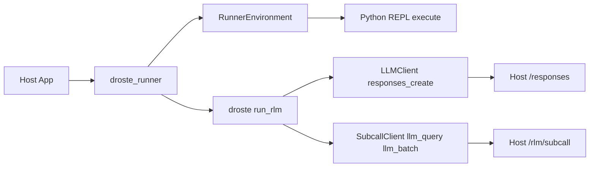

<picture>
  <source media="(prefers-color-scheme: dark)" srcset="docs/assets/droste-dark.svg">
  
</picture>

# Droste

**The recursive harness for your data.**

Droste is a [Recursive Language Model](https://alexzhang13.github.io/blog/2025/rlm/)
(RLM) engine: instead of stuffing your data into a context window, the model
gets it as a **variable in a sandboxed Python REPL**. It inspects the data,
writes code over it, and fans out `llm_query` / `llm_query_batched` subcalls
over the pieces that need semantic judgment — map-reduce, where the model
writes both the map and the reduce.

Coding harnesses bolt a model onto a transcript. Droste harnesses it to data.

```bash
export OPENAI_API_KEY=sk-...     # any OpenAI-compatible endpoint works

uvx droste "which customer had a failed charge, and why?" server.log
uvx droste "which plan has the highest refund rate vs its MRR?" shop.db
```


The first example, against a 231 KB log with `gemini-3.5-flash`:

```
$ droste "Which customer had a failed charge, for what amount, and why?
  How many timeout errors are there, and which upstream do they blame?" server.log

1. Failed charge: customer cus_9982, amount 1499 ($14.99), reason card_declined
2. Timeout errors: 66 total; all blame the upstream service payments-v2
```

The counts are exact because the model *counted them in Python* — it never
read 4,000 log lines through its attention. In `--db` mode the model
introspects your schema, writes read-only SQL, and computes over the rows;
in the demo above it noticed the free plan makes refund-rate-vs-MRR
undefined and answered for the paid plans instead.

## Why

Long-context models read everything and still miss things. Retrieval finds
the right chunk but can't compute across all of them. An RLM does what you
would do: look at the shape of the data, narrow mechanically (regex and SQL
find *where*; subcalls understand *what*), delegate semantic judgment in
bounded batches, and aggregate in code.

Measured on OOLONG (131k-token contexts, 50 tasks, `gemini-3.5-flash`
everywhere):

| approach | score | cost/task | wall/task |
|---|---|---|---|
| **Droste** (server defaults) | **0.84** | ~$0.37 | 27s |
| same model, full context inline | 0.52 | ~$0.26 | 44s |
| dspy.RLM (matched models & budgets) | 0.74 | ~$0.26 | 73s |

+32 points over stuffing the window, at comparable cost. On
[TAG-Bench](https://github.com/TAG-Research/TAG-Bench) (agentic analysis
over SQL), Droste scores **50%** strict-match where published text-to-SQL
baselines sit under 20% — no pipeline, just `droste` pointed at the .db file.

<sub>Caveats: one dataset per benchmark, one context length, one model
family, n=50. Per-task artifacts and cost derivations ship with the
benchmark harness.</sub>

## Use it

Ask questions over files, folders, and SQLite from the terminal — BYOK
against any OpenAI-compatible endpoint. The contract: **args that exist are
data, the one that doesn't is the question, no args means the current
directory, pipes are data too — and it always prints one line saying what
it read.**

```bash
uvx droste "…" ./docs        # zero-install, npx-style
uv tool install droste       # or keep the binary around
pipx install droste          # the older equivalent
```

```bash
export OPENAI_API_KEY=sk-...          # or --api-key
droste "what changed between these?" report.txt logs.txt --model gpt-5.2-mini
droste "which customers churned last month?" app.db --model gpt-5.2-mini
droste "how does auth work here?" ./docs --model gpt-5.2-mini
cd ~/notes && droste "what did I decide about pricing?" --model gpt-5.2-mini
tail -5000 app.log | droste "why did it crash?" --model gpt-5.2-mini
```

SQLite files are recognized by their magic bytes — no flag needed (`--db`
remains as an explicit override). Directory walks skip binaries, dotfiles,
and the usual junk (`.git`, `node_modules`, …) and cap sizes
(`--max-file-bytes`, `--max-bytes`); every skip is counted in the report
line. `droste ask …` still works as an alias.

Files are materialized as the sandbox's `context` variable — the model is
told each file's name and size (not its contents) and pulls data in via
code, so multi-MB files are fine. What the model reads is whatever its code
chooses to print. `--db` uses the engine's local-mode SQL data source (read-only
policy as a guardrail, not a boundary; OS permissions are the boundary).

Engine knobs mirror `RLMConfig`: `--subcall-model`,
`--subcall-max-output-tokens` (default 2048), `--reasoning-effort`,
`--max-iterations`, `--max-subcalls`. `--json` prints a result object for
scripting; `--verbose` streams one-line progress to stderr (watch it think);
`--trace` dumps the full loop (generated code, outputs, responses). Exit code 0 means a
confirmed (or extracted-with-note) answer.

Three worked starting points live in [docs/recipes.md](docs/recipes.md)
(logs, chat archives, SQLite).

Pointing `--base-url` at ModelRelay lights up the platform features
(validated SQL policies, server-enforced subcall cost controls, audit) —
documented, not required. `droste` is the engine CLI; `mrl` remains the
ModelRelay platform CLI.

## Embed it

The same wheel is the engine as a library — zero runtime dependencies,
`urllib`-only. Add it to your app and point the loop at your own data
sources:

```bash
uv add droste        # or: pip install droste
```

Using is asking over *your* data; embedding is building RLM answers into a
product for *your users*.

### BYOK: any OpenAI-compatible endpoint

The engine ships built-in clients for any endpoint that speaks the OpenAI
chat-completions shape (OpenAI, OpenRouter, Google's OpenAI-compat endpoint,
vLLM, Ollama, ...). Bring your own key — no ModelRelay account required.

```python
from droste import (
    OpenAICompatClient,
    OpenAICompatSubcallClient,
    create_execution_context,
    run_rlm,
)

context = create_execution_context(max_calls=50, max_depth=1)
root = OpenAICompatClient(model="gpt-5.2-mini")  # OPENAI_API_KEY / OPENAI_BASE_URL from env
subcalls = OpenAICompatSubcallClient(
    model="gpt-5.2-mini",
    context=context,               # shared call/token accounting
    max_output_tokens=2048,        # per-subcall output bound (cost control)
)

env = ...  # your RLMEnvironment implementation (see Core Concepts below)
result = run_rlm(question, environment=env, root_llm=root, subcalls=subcalls, context=context)
```

Explicit `base_url=` / `api_key=` constructor args win over the environment
variables. Subcall batches run with bounded concurrency (5 workers) and every
subcall's usage block is added to `result.tokens_used`.

`reasoning_effort` and `extra_body` pass through to the endpoint as-is.
Disabling thinking per-subcall is a gateway capability: ModelRelay enforces
it server-side; raw endpoints may ignore a client-side disable.

### Runner architecture (droste_runner)

The `droste_runner` package is a thin orchestration layer that wires `droste` to
HTTP-backed root LLM calls and subcalls. It is shared across hosts (ModelRelay,
Recall, etc.) so the loop logic stays in one place. For custom environments,
set `adapter_module` in the runner request to delegate to an adapter module's
`run(request)` function.



**Runner Inputs**
- `root_endpoint` + `subcall_endpoint` + `token`: required for HTTP-backed runs.
- `adapter_module`: optional Python module path to override the runner entirely.

### Core concepts

#### Protocols

Implement these to integrate with your infrastructure:

- **`RLMEnvironment`** - Sandboxed Python REPL with data access
- **`LLMClient`** - Chat completion interface for the root LLM
- **`SubcallClient`** - Provides `llm_query()` and `llm_batch()` for sub-LLM calls
- **`DataSource`** - Optional data source integration

#### Configuration

```python
RLMConfig(
    max_iterations=20,      # Max refinement loops (default)
    max_depth=1,            # Max nested subcall depth (default)
    max_calls=50,           # Max total subcalls (default)
    max_output_chars=25000, # Output budget per iteration (default)
)
```

#### Result

```python
RLMResult(
    answer="...",           # Final answer from answer["content"]
    ready=True,             # Whether answer["ready"] was set
    iterations=3,           # Iterations used
    tokens_used=1500,       # Total tokens consumed
    sub_calls_made=12,      # Total llm_query/llm_batch calls
    trajectory=[...],       # Full execution history
)
```

## Development

```bash
uv sync          # Install dependencies
uv run pytest    # Run tests
uv build         # Build wheel
```

## The name

The [Droste effect](https://en.wikipedia.org/wiki/Droste_effect) is the
picture that contains itself. M.C. Escher's *Print Gallery* pushed it to its
limit — a man in a gallery viewing a print that contains the gallery he is
standing in — and Escher left the center of the spiral famously blank,
signed but uncompleted, where the recursion outran his hand. Fifty years
later, mathematicians completed it; their project was titled *"The
Mathematics Behind the Droste Effect."*

The answer at the center of the spiral — the part the picture couldn't hold
— is what recursion computes.

## License

Apache-2.0. See [LICENSE](LICENSE). Contributions welcome —
[CONTRIBUTING.md](CONTRIBUTING.md). Versioning is semver; the runner
protocol and source-registry contract carry an explicit compatibility
window (see [docs/architecture.md](docs/architecture.md)).
