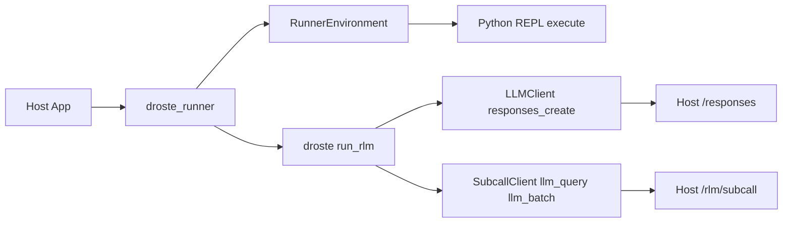

<picture>
  <source media="(prefers-color-scheme: dark)" srcset="docs/assets/droste-dark.svg">
  
</picture>

# Droste

**A recursive analysis engine for data too large for a context window.**

Droste is an open execution engine built on the
[Recursive Language Model](https://alexzhang13.github.io/blog/2025/rlm/) (RLM)
technique. Instead of putting an entire corpus in a prompt, Droste exposes it as
a **variable in a sandboxed Python REPL**. The model writes programs over that
variable and delegates bounded pieces that need semantic judgment through
`llm_query` / `llm_query_batched`.

## Not a general-purpose agent

General coding and tool agents choose actions across open-ended tasks. When
they retrieve material, the observations return through the model's
conversation context. Droste has a narrower job: run model-written programs
over a corpus, use Python or SQL for exact computation, and send only selected
semantic work to model subcalls. Its program may print excerpts into context,
but the full corpus does not have to pass through the context window.

This separation keeps the mechanism explicit: code locates and aggregates;
subcalls interpret bounded inputs; the root model assembles the answer within
configured iteration, subcall, and output limits.

```bash
uvx droste "which customer had a failed charge, and why?" server.log
uvx droste "which plan has the highest refund rate vs its MRR?" shop.db
uvx droste "how do the authentication flows differ?" ./docs
```


The first example runs against a 444 kB log:

```
$ droste "Which customer had a failed charge, for what amount, and why?
  How many timeout errors are there, and which upstream do they blame?" server.log

1. **Failed Charge Details**:
   - **Customer**: `cus_9982`
   - **Amount**: 1499 (USD, which is $14.99)
   - **Reason**: The card was declined due to insufficient funds
     (`reason=card_declined decline_code=insufficient_funds`).

2. **Timeout Errors**:
   - **Count**: There are exactly 66 timeout errors in the log.
   - **Upstream blamed**: They blame `payments-v2` (`upstream=payments-v2`).
```

The counts are exact because the model *counted them in Python* — it never
read 3,400 log lines through its attention. In `--db` mode the model
introspects your schema, writes read-only SQL, and computes over the rows;
in the demo above it noticed the free plan makes refund-rate-vs-MRR
undefined and answered for the paid plans instead.

## Why this structure

Mechanical work stays mechanical: regex and SQL find *where*, model subcalls
interpret *what*, and code combines the results. The root can inspect the
shape of the corpus, narrow it without model calls, and fan out only when a
step requires semantic judgment.

Execution is bounded by explicit iteration, subcall, and output limits. Root
and subcall models can be configured independently. These controls make the
work observable and limitable; they are not a promise of a particular answer
quality, latency, or price, which depend on the data, models, and endpoint.

## Reproducible evidence

The repository ships a [versioned benchmark harness](benchmarks/README.md),
immutable per-task artifact schemas, deterministic scorers, and report
generation. A zero-cost smoke run checks the artifact and reporting path
without making network calls:

```bash
output="$(mktemp -d)/droste-benchmark-smoke"
uv run python -m benchmarks smoke --output "$output"
```

The smoke run validates the machinery, not model quality. Today the
[suite manifest](benchmarks/manifests/rlm-paper-v1.json) has one ready dataset:
a pinned 50-task, 131K-token OOLONG slice that must be materialized from its
public source. Its live arms remain blocked until a public model configuration
and immutable results are published; the other named benchmark families remain
`planned`. This README therefore does not present score, cost, or latency
numbers as reproducible results. Publishing the configuration, artifacts, and
reports is tracked in [#81](https://github.com/tensor-systems/droste/issues/81).

## Use it

Ask questions over files, folders, and SQLite from the terminal. The
contract: **args that exist are data, the one that doesn't is the question,
no args means the current directory, pipes are data too — and it always
prints one line saying what it read.**

```bash
uvx droste "…" ./docs        # zero-install, npx-style
uv tool install droste       # or keep the binary around
pipx install droste          # the older equivalent
```

```bash
droste login                 # one-time setup: free credits, or your own key
droste "what changed between these?" report.txt logs.txt
droste "which customers churned last month?" app.db
droste "how does auth work here?" ./docs
cd ~/notes && droste "what did I decide about pricing?"
tail -5000 app.log | droste "why did it crash?"
```

SQLite files are recognized by their magic bytes — no flag needed (`--db`
remains as an explicit override). Directory walks skip binaries, dotfiles,
and the usual junk (`.git`, `node_modules`, …) and cap sizes
(`--max-file-bytes`, `--max-bytes`); every skip is counted in the report
line. `droste ask …` still works as an alias.

Files are materialized as the sandbox's `context` variable — the model is
told each file's name and size (not its contents) and pulls data in via
code, so multi-MB files are fine. What the model reads is whatever its code
chooses to print. `--db` uses the engine's local-mode SQL data source (read-only
policy as a guardrail, not a boundary; OS permissions are the boundary).

Engine knobs mirror `RLMConfig`: `--subcall-model`,
`--subcall-max-output-tokens` (default 2048), `--reasoning-effort`,
`--max-iterations`, `--max-subcalls`. `--json` prints a result object for
scripting; `--verbose` streams one-line progress to stderr (watch it think);
`--trace` renders the full structured event stream — generated code, execution
output with per-iteration sub-call counts and answer state, LLM responses,
execution errors. Exit code 0 means a confirmed (or extracted-with-note)
answer.

Three worked starting points live in [docs/recipes.md](docs/recipes.md)
(logs, chat archives, SQLite).

Droste is the open execution engine. Compatible hosted gateways and control
planes can add authentication, server-enforced policy and cost limits, and
audit around it; those services are integrations, not part of the engine.
Use `--base-url` to select a compatible endpoint.

## Embed it

The same wheel is the engine as a library — zero runtime dependencies,
`urllib`-only. Add it to your app and point the loop at your own data
sources:

```bash
uv add droste        # or: pip install droste
```

Using is asking over *your* data; embedding is building RLM answers into a
product for *your users*.

### BYOK: OpenAI-compatible endpoints, and Anthropic natively

The engine ships built-in clients for any endpoint that speaks the OpenAI
chat-completions shape (OpenAI, OpenRouter, Google's OpenAI-compat endpoint,
vLLM, Ollama, ...) — plus a native client for Anthropic's Messages API
(their compat layer is a testing shim, so Claude gets its own client).
Bring your own key — no hosted account required. The CLI detects the provider
from facts: an `sk-ant-…` key (or `ANTHROPIC_API_KEY`) routes to
Anthropic; an explicit `--base-url`/`OPENAI_BASE_URL` always wins.

```bash
export ANTHROPIC_API_KEY=sk-ant-...
droste "why did it crash?" ./logs --model claude-opus-4-8
```

```python
from droste import (
    OpenAICompatClient,
    OpenAICompatSubcallClient,
    create_execution_context,
    run_rlm,
)

context = create_execution_context(max_calls=50, max_depth=1)
root = OpenAICompatClient(model="gpt-5.2-mini")  # OPENAI_API_KEY / OPENAI_BASE_URL from env
subcalls = OpenAICompatSubcallClient(
    model="gpt-5.2-mini",
    context=context,               # shared call/token accounting
    max_output_tokens=2048,        # per-subcall output bound (cost control)
)

env = ...  # your RLMEnvironment implementation (see Core Concepts below)
result = run_rlm(question, environment=env, root_llm=root, subcalls=subcalls, context=context)
```

Explicit `base_url=` / `api_key=` constructor args win over the environment
variables. Subcall batches run with bounded concurrency (5 workers) and every
subcall's usage block is added to `result.tokens_used`.

`reasoning_effort` and `extra_body` pass through to the endpoint as-is.
Disabling thinking per-subcall is a gateway capability: a compatible gateway
may enforce it server-side, while raw endpoints may ignore a client-side
disable.

### Runner architecture (droste_runner)

The `droste_runner` package is a thin orchestration layer that wires `droste` to
HTTP-backed root LLM calls and subcalls. It is shared across hosted and
in-process embedders so the loop logic stays in one place. For custom environments,
set `adapter_module` in the runner request to delegate to an adapter module's
`run(request)` function.



**Runner Inputs**
- `protocol_version`: **required** on every request (currently `1`) — a
  missing or mismatched version gets a structured refusal, so hosts detect
  incompatibility instead of failing on a missing field. See
  [docs/architecture.md](docs/architecture.md) for the compatibility rules and
  [UPGRADING.md](UPGRADING.md) for per-release embedder migration notes.
- `root_endpoint` + `subcall_endpoint` + `token`: required for HTTP-backed runs.
- `adapter_module`: optional Python module path to override the runner entirely.

### Core concepts

#### Protocols

Implement these to integrate with your infrastructure:

- **`RLMEnvironment`** - Sandboxed Python REPL with data access
- **`LLMClient`** - Chat completion interface for the root LLM
- **`SubcallClient`** - Provides `llm_query()` and `llm_batch()` for sub-LLM calls
- **`DataSource`** - Optional data source integration

#### Data sources are domain-blind

`DataSource` carries core verbs only — `query`, `search`, `get`,
`get_recent`, `get_schema`, `get_stats`, plus the generic optionals
`find`/`content`/`sample`. The engine knows nothing about any product's
data shape. A source with domain-specific verbs declares them itself:

```python
class MessageArchiveSource:
    extra_methods = ("get_messages", "get_chats")  # your verbs, your names
    ...
```

Exactly those callables are exposed to the sandbox — validated against
engine verbs, Python builtins, and reserved names — and the declaration
works identically in-process and across the Pyodide bridge. Registrations
via `register_source_type` must pass the source-protocol version they
implement (`protocol=2` today); a stale extension fails loudly at startup
instead of silently losing its verbs.

#### Configuration

```python
RLMConfig(
    max_iterations=20,      # Max refinement loops (default)
    max_depth=1,            # Max nested subcall depth (default)
    max_calls=50,           # Max total subcalls (default)
    max_output_chars=25000, # Output budget per iteration (default)
    prompt_profile="full",  # Versioned prompt-pack profile (full/minimal/none)
    policy_hints=PolicyHints(semantic=True), # Optional explicit contract
)
```

Harness prompts resolve once per run from immutable, versioned data. See
[Prompt packs](docs/prompt-packs.md) for the stable five-slot contract, custom
pack loading, deterministic fallback order, and provenance records.

Droste does not infer semantic intent from the question. When a caller supplies
`PolicyHints(semantic=True)`, at least one semantic subcall must succeed and any
incomplete `llm_batch_json` result blocks confirmation. Only an error-free
repeat with the exact prompts, contexts, schema, and validator object resolves
that partial evidence. Omit the hint to retain purely prompt-driven behavior.

#### Result

```python
RLMResult(
    answer="...",           # Final answer from answer["content"]
    ready=True,             # Whether answer["ready"] was set
    iterations=3,           # Iterations used
    tokens_used=1500,       # Total tokens consumed
    sub_calls_made=12,      # Total llm_query/llm_batch calls
    trajectory=[...],       # Full execution history
    extracted=False,        # True if the answer came from the post-exhaustion
                            # extract pass (best-effort, not confirmed)
    prompt_pack=...,        # Frozen resolved pack identity + provenance
)
```

## Development

```bash
uv sync          # Install dependencies
uv run pytest    # Run tests
uv build         # Build wheel
```

## The name

The [Droste effect](https://en.wikipedia.org/wiki/Droste_effect) is the
picture that contains itself. M.C. Escher's *Print Gallery* pushed it to its
limit — a man in a gallery viewing a print that contains the gallery he is
standing in — and Escher left the center of the spiral famously blank,
signed but uncompleted, where the recursion outran his hand. Fifty years
later, mathematicians completed it; their project was titled *"The
Mathematics Behind the Droste Effect."*

The answer at the center of the spiral — the part the picture couldn't hold
— is what recursion computes.

## License

Apache-2.0. See [LICENSE](LICENSE). Contributions welcome —
[CONTRIBUTING.md](CONTRIBUTING.md). Versioning is semver; the runner
protocol and source-registry contract carry an explicit compatibility
window (see [docs/architecture.md](docs/architecture.md)).
