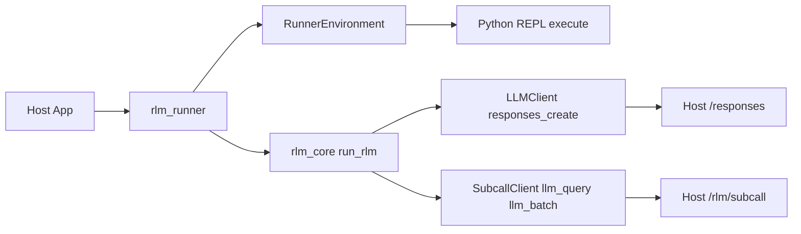

# rlm-core

Core library implementing the Recursive Language Model (RLM) - a scaffolding approach that enables LLMs to handle effectively unbounded context through recursive self-calls and code execution.

## What is RLM?

RLM lets language models manage large contexts by treating input as a programmable variable rather than direct context. The model writes Python code to inspect, partition, and delegate work to sub-LLM instances, keeping the primary context window lean.

**Key insight:** LLMs should decide how to decompose problems, not humans. RLM provides "the illusion of near infinite context, while under the hood a language model manages, partitions, and recursively calls itself."

Learn more:
- [Recursive Language Models](https://alexzhang13.github.io/blog/2025/rlm/) - Alex Zhang
- [RLM: Scalable Context with Recursive LLMs](https://www.primeintellect.ai/blog/rlm) - Prime Intellect

## How It Works

1. Root LLM receives a question (not the full context)
2. LLM generates Python code to inspect/process data
3. Code executes in a sandboxed REPL with access to `llm_query()` and `llm_batch()` for sub-calls
4. Output feeds back to LLM for refinement
5. Loop continues until `answer["ready"] = True`

## Installation

```bash
# From private index
uv pip install --index-url "https://${PYPI_TOKEN}:x@rlm-pypi.hyperpredict.workers.dev/simple" rlm-core

# For offline builds
uv pip download --dest wheelhouse --index-url "https://${PYPI_TOKEN}:x@rlm-pypi.hyperpredict.workers.dev/simple" rlm-core
uv pip install --no-index --find-links wheelhouse rlm-core
```

## Quick Start

```python
from rlm_core import run_rlm, RLMConfig

result = run_rlm(
    question="Summarize the key themes across these documents.",
    environment=my_environment,  # RLMEnvironment implementation
    root_llm=my_llm_client,      # LLMClient implementation
    subcalls=my_subcall_client,  # SubcallClient for llm_query/llm_batch
    config=RLMConfig(max_iterations=10),
)

print(result.answer)
print(f"Completed in {result.iterations} iterations, {result.sub_calls_made} sub-calls")
```

## The droste CLI

The wheel ships a `droste` binary — ask questions over files and SQLite from
the terminal, BYOK against any OpenAI-compatible endpoint:

```bash
export OPENAI_API_KEY=sk-...          # or --api-key
droste ask report.txt logs.txt "what changed between these?" --model gpt-5.2-mini
droste ask --db app.db "which customers churned last month?" --model gpt-5.2-mini
```

Files are materialized as the sandbox's `context` variable (the model sees
sizes and previews, not raw bytes, and pulls data in via code — multi-MB files
are fine). `--db` uses the engine's local-mode SQL data source (read-only
policy as a guardrail, not a boundary; OS permissions are the boundary).

Engine knobs mirror `RLMConfig`: `--subcall-model`,
`--subcall-max-output-tokens` (default 2048), `--reasoning-effort`,
`--max-iterations`, `--max-subcalls`. `--json` prints a result object for
scripting; `--verbose` streams progress to stderr. Exit code 0 means a
confirmed (or extracted-with-note) answer.

Pointing `--base-url` at ModelRelay lights up the platform features
(validated SQL policies, server-enforced subcall cost controls, audit) —
documented, not required. `droste` is the engine CLI; `mrl` remains the
ModelRelay platform CLI.

## BYOK: run against any OpenAI-compatible endpoint

The engine ships built-in clients for any endpoint that speaks the OpenAI
chat-completions shape (OpenAI, OpenRouter, Google's OpenAI-compat endpoint,
vLLM, Ollama, ...). Bring your own key — no ModelRelay account required.

```python
from rlm_core import OpenAICompatClient, OpenAICompatSubcallClient, create_execution_context

context = create_execution_context(max_calls=50, max_depth=1)
root = OpenAICompatClient(model="gpt-5.2-mini")  # OPENAI_API_KEY / OPENAI_BASE_URL from env
subcalls = OpenAICompatSubcallClient(
    model="gpt-5.2-mini",
    context=context,               # shared call/token accounting
    max_output_tokens=2048,        # per-subcall output bound (cost control)
)

result = run_rlm(question, environment=env, root_llm=root, subcalls=subcalls, context=context)
```

Explicit `base_url=` / `api_key=` constructor args win over the environment
variables. Subcall batches run with bounded concurrency (5 workers) and every
subcall's usage block is added to `result.tokens_used`.

**Honest note on thinking control:** `reasoning_effort` and `extra_body` are
passed through to the endpoint as-is. Server-side thinking control (e.g.
disabling Gemini thinking per subcall) is a gateway capability — on ModelRelay
these knobs are enforced server-side; BYOK gets whatever the raw endpoint
honors (we measured litellm/gemini ignoring a client-side disable).

## Runner Architecture (rlm_runner)

The `rlm_runner` package is a thin orchestration layer that wires `rlm_core` to
HTTP-backed root LLM calls and subcalls. It is shared across hosts (ModelRelay,
Recall, etc.) so the loop logic stays in one place. For custom environments,
set `adapter_module` in the runner request to delegate to an adapter module's
`run(request)` function.



**Runner Inputs**
- `root_endpoint` + `subcall_endpoint` + `token`: required for HTTP-backed runs.
- `adapter_module`: optional Python module path to override the runner entirely.

## Core Concepts

### Protocols

Implement these to integrate with your infrastructure:

- **`RLMEnvironment`** - Sandboxed Python REPL with data access
- **`LLMClient`** - Chat completion interface for the root LLM
- **`SubcallClient`** - Provides `llm_query()` and `llm_batch()` for sub-LLM calls
- **`DataSource`** - Optional data source integration

### Configuration

```python
RLMConfig(
    max_iterations=10,      # Max refinement loops
    max_depth=3,            # Max nested subcall depth
    max_calls=50,           # Max total subcalls
    max_output_chars=50000, # Output budget per iteration
)
```

### Result

```python
RLMResult(
    answer="...",           # Final answer from answer["content"]
    ready=True,             # Whether answer["ready"] was set
    iterations=3,           # Iterations used
    tokens_used=1500,       # Total tokens consumed
    sub_calls_made=12,      # Total llm_query/llm_batch calls
    trajectory=[...],       # Full execution history
)
```

## Development

```bash
uv sync          # Install dependencies
uv run pytest    # Run tests
uv build         # Build wheel
```

## License

Proprietary - Tensor Systems
