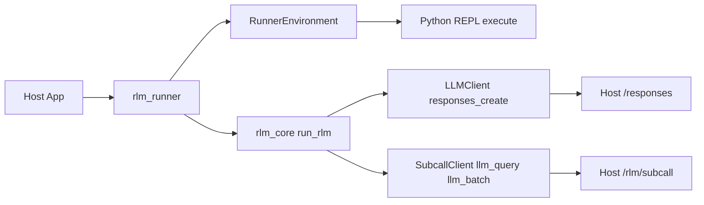

# rlm-core

Core library implementing the Recursive Language Model (RLM) - a scaffolding approach that enables LLMs to handle effectively unbounded context through recursive self-calls and code execution.

## What is RLM?

RLM lets language models manage large contexts by treating input as a programmable variable rather than direct context. The model writes Python code to inspect, partition, and delegate work to sub-LLM instances, keeping the primary context window lean.

**Key insight:** LLMs should decide how to decompose problems, not humans. RLM provides "the illusion of near infinite context, while under the hood a language model manages, partitions, and recursively calls itself."

Learn more:
- [Recursive Language Models](https://alexzhang13.github.io/blog/2025/rlm/) - Alex Zhang
- [RLM: Scalable Context with Recursive LLMs](https://www.primeintellect.ai/blog/rlm) - Prime Intellect

## How It Works

1. Root LLM receives a question (not the full context)
2. LLM generates Python code to inspect/process data
3. Code executes in a sandboxed REPL with access to `llm_query()` and `llm_batch()` for sub-calls
4. Output feeds back to LLM for refinement
5. Loop continues until `answer["ready"] = True`

## Installation

```bash
# From private index
uv pip install --index-url "https://${PYPI_TOKEN}:x@rlm-pypi.hyperpredict.workers.dev/simple" rlm-core

# For offline builds
uv pip download --dest wheelhouse --index-url "https://${PYPI_TOKEN}:x@rlm-pypi.hyperpredict.workers.dev/simple" rlm-core
uv pip install --no-index --find-links wheelhouse rlm-core
```

## Quick Start

```python
from rlm_core import run_rlm, RLMConfig

result = run_rlm(
    question="Summarize the key themes across these documents.",
    environment=my_environment,  # RLMEnvironment implementation
    root_llm=my_llm_client,      # LLMClient implementation
    subcalls=my_subcall_client,  # SubcallClient for llm_query/llm_batch
    config=RLMConfig(max_iterations=10),
)

print(result.answer)
print(f"Completed in {result.iterations} iterations, {result.sub_calls_made} sub-calls")
```

## Runner Architecture (rlm_runner)

The `rlm_runner` package is a thin orchestration layer that wires `rlm_core` to
HTTP-backed root LLM calls and subcalls. It is shared across hosts (ModelRelay,
Recall, etc.) so the loop logic stays in one place.



## Core Concepts

### Protocols

Implement these to integrate with your infrastructure:

- **`RLMEnvironment`** - Sandboxed Python REPL with data access
- **`LLMClient`** - Chat completion interface for the root LLM
- **`SubcallClient`** - Provides `llm_query()` and `llm_batch()` for sub-LLM calls
- **`DataSource`** - Optional data source integration

### Configuration

```python
RLMConfig(
    max_iterations=10,      # Max refinement loops
    max_depth=3,            # Max nested subcall depth
    max_calls=50,           # Max total subcalls
    max_output_chars=50000, # Output budget per iteration
)
```

### Result

```python
RLMResult(
    answer="...",           # Final answer from answer["content"]
    ready=True,             # Whether answer["ready"] was set
    iterations=3,           # Iterations used
    tokens_used=1500,       # Total tokens consumed
    sub_calls_made=12,      # Total llm_query/llm_batch calls
    trajectory=[...],       # Full execution history
)
```

## Development

```bash
uv sync          # Install dependencies
uv run pytest    # Run tests
uv build         # Build wheel
```

## License

Proprietary - Tensor Systems
