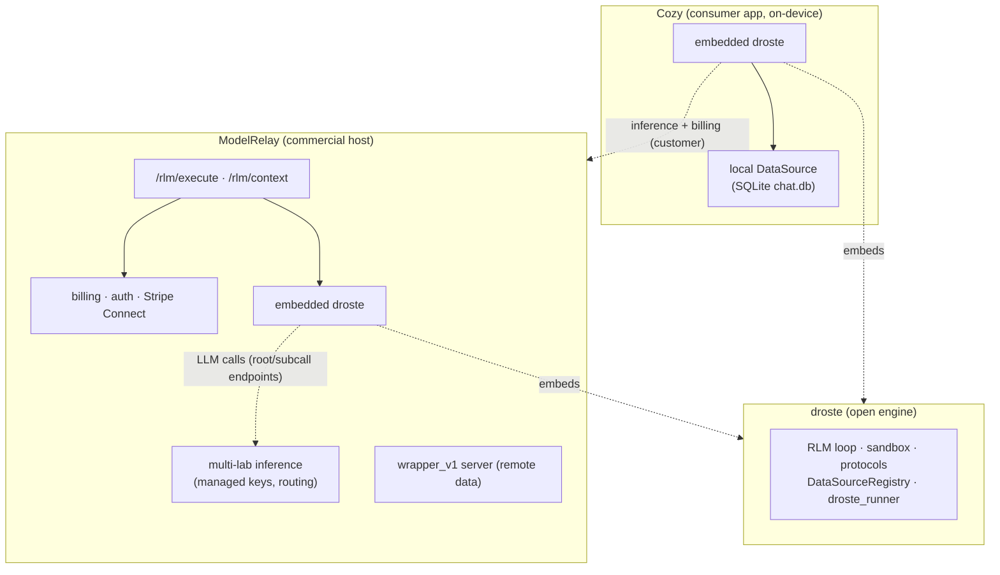

# Unified Data Sources — design spec

**Status:** adopted (Option C shipped; registry-through-runner shipped in 0.3.0)
**Issue:** tensor-systems/droste#9

This spec does two things:
1. Draws the boundaries between **Cozy**, **droste**, and **ModelRelay** (shared context).
2. Specifies how to **unify the two parallel "data source" mechanisms** into one abstraction so SQL and filesystem sources become straightforward.

---

## 1. Boundaries: Cozy / droste / ModelRelay

### Who owns what

| Layer | Repo | Language | Owns | Explicitly does NOT own |
|---|---|---|---|---|
| **droste** (engine) | `tensor-systems/droste` | Python (+ Pyodide/Deno substrate) | The RLM loop (`run_rlm`), the code-exec sandbox, the protocols (`RLMEnvironment`, `DataSource`, `LLMClient`, `SubcallClient`), the `DataSourceRegistry`, the `droste_runner` entrypoint | Provider API keys, billing, auth, DB drivers, persistence. **LLM calls go *out* via host-provided HTTP endpoints** (`root_endpoint`/`subcall_endpoint` + token) — the engine never holds keys. |
| **ModelRelay** (commercial host) | closed source | Go | Embeds droste (pinned + CI-gated sync); drives the runner; **provides the LLM endpoints the runner calls back into** (multi-lab routing + managed keys); billing/metering/PAYGO; auth/customer tokens; Stripe Connect; hosted sandbox fleet; `wrapper_v1` *server*; `/rlm/execute` + `/rlm/context`; observability; VPC/compliance | The RLM algorithm itself (delegated to droste) |
| **Cozy** (consumer app) | `tensor-systems/cozy` | Swift/macOS + Python | Runs droste **in-process, on-device**; implements its **own concrete `DataSource`** over a local SQLite `chat.db` (iMessages); is a **ModelRelay customer** for inference + billing | The engine (uses droste), inference (uses ModelRelay) |

### The one-sentence version
**droste is the loop + the contracts (no keys, no DB, no billing). ModelRelay is the paid host that supplies inference + billing + remote data + hosted execution. Cozy is a consumer that runs the engine locally with a local data source and rents inference from ModelRelay.**

### Diagram



### "Runs where the data is" — three deployment modes (same engine)

| Mode | Engine runs | Data source | Inference | Example |
|---|---|---|---|---|
| **On-device** | user's machine | in-process, local (SQLite) | ModelRelay | **Cozy** today |
| **Hosted** | ModelRelay cloud | `wrapper_v1` (remote HTTP) | ModelRelay | `/rlm/execute` today |
| **In-boundary / VPC** | customer's VPC | in-process (SQL/fs next to the data) | ModelRelay | the SQL/fs target sources |

The point of this spec: the **in-boundary mode** needs in-process SQL/fs data sources, and today the hosted runner can only do `wrapper_v1`. That's the gap.

---

## 2. Problem: two things both called "data source"

*(This section frames the **pre-#11** state that motivated the work. #11 has since shipped the registry-through-runner unification described in §3.1/§7 — the runner now builds sources and passes a `DataSourceRegistry` into `RunnerEnvironment`. Read §2 as the problem statement, not current state.)*

Before this work there were **two parallel, non-interoperating mechanisms**:

1. **`wrapper_v1`** — `droste_runner/runner.py::DataSourceWrapper`. A thin **remote HTTP** client (`/search`, `/get`, `/content`) with budgets + SSRF guards. The runner special-cases the request's `data_source` dict and injects flat globals `data_source_search` / `data_source_get` / `data_source_content`. **This is the only path the runner wires.**
2. **`DataSource` protocol + `DataSourceRegistry`** — `droste/protocols/data_source.py` + `registry.py`. A rich **in-process** abstraction: `capabilities` (`sql`/`search`/`get`) + `query(sql)` / `search` / `find` / `get` / `get_schema` / `get_stats` / `sample` / chat helpers. Exposed as **namespaced** globals (`env[name] = {query, search, ...}`, optionally flattened for a default source). **Exported for consumers (Cozy builds one); the runner never touches it; nothing in droste constructs it.**

Consequences:
- The richer abstraction (with `query()` for SQL, `get_schema()` for introspection) is **unreachable through the hosted runner**.
- "Data source" is ambiguous — a remote HTTP contract *and* an in-process protocol.
- SQL/fs sources have nowhere to plug into the hosted path.

---

## 3. Design: one abstraction, multiple transports

**Principle:** `DataSource` (the protocol) is the **single** "data source" concept. Everything is a `DataSource`; transports differ.

- **In-process transport** — a Python `DataSource` object (local/VPC/embedded). Used by Cozy, and by the future SQL/fs sources.
- **Remote transport** — HTTP. **`wrapper_v1` becomes a `DataSource` implementation** (`WrapperV1DataSource`) that proxies `search`/`get`/`content` to a partner API. It is *registered like any other source*, not a parallel path. Its budgets/SSRF guards move with it.

### 3.1 Make the runner use the registry

Replace the `wrapper_v1` special-casing in `run()` with: build a `DataSourceRegistry` from the request, then merge `registry.globals()` into the environment globals and use `registry.prompt_fragment()`.

```python
# runner.run(), replacing the DataSourceWrapper special-case
sources = build_data_sources(request)                 # list[DataSource]
registry = DataSourceRegistry(sources, default_source_name=request.get("default_source"))
environment = RunnerEnvironment(context=context, subcalls=subcalls, ...)
environment.merge_globals(registry.globals())          # namespaced + default-flattened
environment.set_data_prompt(registry.prompt_fragment())
```

`RunnerEnvironment` drops its `data_source`-dict handling; data-source globals/prompt now come from the registry. (`RLMEnvironment` protocol unchanged: `capabilities`/`globals`/`prompt_fragment`/`execute`/`close`.)

### 3.2 `WrapperV1DataSource` (the remote adapter)

Wrap the existing `DataSourceWrapper` HTTP logic in the `DataSource` protocol:

```python
class WrapperV1DataSource:                 # implements DataSource
    def name(self): return self._name      # default "wrapper"
    def capabilities(self): return {"search": True, "get": True}
    def get_schema(self): return "Remote wrapper_v1 source (search/get/content)."
    def search(self, query, filters=None, page=None): ...   # → HTTP /search
    def get(self, id): ...                                   # → HTTP /get
    def content(self, id, format="text", max_bytes=None): ...# → HTTP /content (extra method, exposed via hasattr)
```

The registry already exposes `search`/`get` by capability and any extra method (`content`) via the `hasattr` path.

### 3.3 Request shape (new)

```jsonc
{
  "data_sources": [
    { "type": "wrapper_v1", "name": "partner", "base_url": "...", "token": "...",
      "allowed_hosts": [...], "limits": { "max_requests": 20, "max_response_bytes": 1048576 } },
    { "type": "sql", "name": "db", "profile_id": "...", "source_id": "..." },
    { "type": "fs",  "name": "vault", "root": "/data/vault", "glob": "**/*.md" }
  ],
  "default_source": "db"        // optional: flattens that source's methods to top-level globals
}
```

The `sql` entry carries **declarative data only** — a `profile_id` (the validation policy, resolved cloud-side by `POST /sql/validate`, §4) and a `source_id`. It deliberately carries **no `dsn`/credentials**: the live read-only connection is supplied by the host through the factory `ctx` at the edge (§7.2/§7.3), never by the portable request. This is what keeps the request safe to originate from an untrusted caller and keeps credentials out of the cloud.

Singular `data_source` may remain as sugar for a one-element list during migration, or be dropped (see §6 — clean break is acceptable).

### 3.4 Who constructs SQL/fs sources? (the key decision)

droste defines the protocol but ships **no concrete SQL/fs** source. Three options:

- **Option A — droste ships reference `sql` + `fs` DataSources.** `build_data_sources()` maps `type → class`. *Pro:* batteries-included; any consumer gets SQL/fs. *Con:* the engine takes on DB drivers / filesystem concerns — heavier, against the "minimal embeddable engine" positioning.
- **Option B — consumers inject sources via the request-controlled `adapter_module` seam.** The runner supports `request.adapter_module` → delegates to a consumer-provided `run(request)`. *Pro:* engine stays protocol-only; DB drivers/policy live with the consumer. *Con:* the module path is **request-controlled**, so a hosted runner importing it is RCE-by-config — an import allowlist becomes mandatory (the whole of the old §7.2). Each consumer also re-implements the loop, not just the sources.
- **Option C — consumers register source-type *factories* at build time; the request carries data only.** Each consumer ships its own thin runner entrypoint that calls `register_source_type("sql", factory)` once at startup. `build_data_sources(request)` maps `type → registered factory`; the request carries `{type: "sql", …}` (data, **no module path**). *Pro:* keeps B's principle — DB drivers/policy live with the consumer that owns the boundary (§4) — **without** a request-controlled import: no RCE-by-config, no allowlist needed; the public request stays declarative; cleanly multi-consumer (ModelRelay registers `sql`/`fs`, Cozy registers `messages`, a third consumer registers its own). *Con:* a consumer must register before serving (a build-time step, not per-request).

**Recommendation: Option C (locked in).** It gets Option B's minimal-engine, policy-with-the-consumer property without making a request-controlled import path load-bearing and security-relevant. The engine ships `register_source_type()` + `build_data_sources()` (type → registered factory); ModelRelay's runner entrypoint registers `sql`/`fs` (where `sqlvalidate`/path-policy already live); Cozy's keeps registering `messages`. The base engine still ships **no** concrete SQL/fs source — only the registry mechanism. This supersedes the original Option-B recommendation and the `adapter_module`-hardening plan (old §7.2 / decision 6); see §7.2 for the build-time-registration contract.

---

## 4. Security / policy boundaries

Each transport owns its guardrails — and they live with whoever owns the boundary, **not** the core loop:

- **wrapper_v1**: keeps existing per-request **budgets** (`max_requests`, `max_response_bytes`, `timeout_ms`) — these live in `DataSourceWrapper` and move into `WrapperV1DataSource`. `allowed_hosts` is **enforced by the engine per-request** in `DataSourceWrapper._call()` (a base_url whose hostname is outside the configured allowlist is refused before any connection; no allowlist configured means the deployer accepts arbitrary hosts). Hosts may additionally enforce network policy in front of the runner — defense in depth, not a substitute.
- **sql**: read-only, SELECT-only, **table/column allowlists** (row/tenant scoping must be added before claiming it). Policy validation runs as a stateless check over the SQL **string** — no DB connection, no credentials — while execution happens **at the edge**, where the connection and data already live. The engine never sees credentials and the host's cloud never sees the data: the validate/execute **split**, not a customer-deployed gateway, is what satisfies "no creds in cloud".
- **fs**: read-only, root/path allowlist, glob scoping — enforced in ModelRelay's fs `DataSource`.

This is why Option C is the safer default: **the engine stays credential- and policy-free**; the consumer that registers the source (and holds the data/connection) also holds the policy.

---

## 5. Capability → sandbox surface

`DataSourceRegistry.globals()` (implemented in #11):
- `env["<name>"]` → an **attribute-accessible namespace object** (`SimpleNamespace`) with the methods the source's `capabilities()` enable: `search`, `query` (if `sql`), `get`, `get_recent`, `get_schema` (if `schema`), `get_stats`, plus `content`/`find`/`sample`/chat helpers via `hasattr`. **Fixed in #11:** the namespace was previously a plain `dict`, so `db.query(...)` raised `AttributeError` (only `db["query"]` worked) — it is now an attribute namespace so the documented `db.query(...)` API actually runs.
- If `default_source` matches, those methods are also flattened to top-level globals. Reserved names (`answer`/`context`/`llm_query`/…) and duplicate/unknown `default_source` are now rejected.

Prompt: `registry.prompt_fragment()` emits a `## Data Sources` section listing each source's `get_schema()` — replacing the hard-coded "Data source: wrapper_v1 …" line. Model guidance becomes accurate per source (e.g., `db.query("SELECT …")`, `vault.search("…")`).

---

## 6. Migration

droste's stated principle is **no backward-compat shims**; ModelRelay has **zero users**. So: clean break.

1. **droste**: land §3.1–3.3 + §3.2. Drop the flat `data_source_*` special-case (or keep only as a `default_source` convenience for a single `wrapper_v1`). Bump minor version.
2. **Hosts** (hosted platform, in-process embedders): re-sync/upgrade the pinned engine; emit `data_sources` in the runner request; register their source-type factories at build time (§7.2, Option C). Host-side sequencing lives with each host.

---

## 7. Engine integration contract (pinning + the adapter seam)

This migration assumes two things that aren't currently guaranteed: (a) the droste embedded in ModelRelay actually *is* the engine this spec describes, and (b) the engine can safely load consumer-supplied data sources without a request-controlled import. (a) is solved by pinning + a CI parity gate (§7.1, shipped); (b) is solved by build-time source-type registration (§7.2, Option C) rather than the original `adapter_module` hardening.

### 7.1 Pin the engine; don't rsync-vendor it

Today ModelRelay embeds droste by `rsync -a --delete` from a loose sibling checkout (`scripts/sync-droste.sh`), run **manually**. Failure modes this already produces:

- **Silent drift.** The embedded copy lags the real engine until a human remembers to re-run the script — exactly why main is "one commit behind `0.2.2`" (§6 note), and the divergence hit on the 1536 branch. Nothing flags it.
- **No provenance.** Nothing records *which* droste commit is embedded. You can't answer "is the vendored tree the spec'd engine?" without a manual diff.
- **No enforcement.** `--delete` mirrors a mutable working tree; a hand-edit to the vendored copy (or an un-synced engine fix) is invisible to CI.

**Fix — pin + assert parity:**

1. **Record the pin.** Write the embedded engine's version/SHA next to the assets (e.g. `platform/rlmrunner/assets/RLM_CORE_VERSION` = a git tag or commit SHA), set by `sync-droste.sh` when it syncs.
2. **CI parity gate.** A CI step re-runs the sync against the *pinned* ref into a temp dir and `git diff --exit-code` (or checksum) vs the committed assets. Fails the build if someone forgot to re-sync, hand-edited the vendored tree, or the pin and the tree disagree. This makes "embedded == spec'd engine" a *checked invariant*, not a hope.
3. **Sync from an immutable ref, not a working tree.** Have the script fetch a tagged droste release (git tag, or a published artifact — see decision 5) rather than `../../tensor-systems/droste` as it happens to sit on disk.

This is a process/CI change, not engine code — but it lives in this spec because §6 step 2 ("re-sync the embedded droste") is only safe if re-syncing is verifiable and pinned.

**Status: shipped (0.3.0 re-sync).** `scripts/sync-droste.sh` now pins `RLM_CORE_VERSION=v0.3.0`, materializes the tag in a throwaway worktree (immutable source), stages-then-swaps the assets atomically, and writes the `platform/rlmrunner/RLM_CORE_VERSION` stamp (tag + SHA). `scripts/check-rlm-assets.sh` is the sha256 parity gate (wired into `.github/workflows/lint.yml` as `rlm-assets-check`): CI fails if the embedded tree diverges from the pinned ref or is hand-edited. "Embedded == pinned engine" is now a checked invariant.

### 7.2 The adapter seam: build-time source-type registration (Option C)

The original plan hardened `request.adapter_module → consumer.run(request)` with a typed protocol + an **import allowlist** + a compat check, because a request-controlled module path in a hosted runner is RCE-by-config. The seam is real in raw `droste_runner` — `runner.py` resolves `request.adapter_module` and `importlib`-imports it. (Note: ModelRelay's current `RunnerRequest` does **not** expose `adapter_module` — it only carries `data_source` — so this hole is **latent, not currently reachable** through ModelRelay's hosted path. The risk is in *making* it reachable to serve SQL/fs, which the old plan would have done.) **Option C removes the problem instead of guarding it:** there is no request-controlled import to allowlist, because the request never names a module — the engine's runnable source types are fixed by the deployment's own entrypoint.

The contract:

- **`register_source_type(type: str, factory)`** — a process-global registry in the engine, populated at **startup** by the consumer's runner entrypoint, never from the request. `factory(config, ctx) -> DataSource` builds a source from the request's per-source config (e.g. `{type: "sql", profile_id, name}`) plus a host-supplied context (the edge connection/handle — see §7.3).
- **`build_data_sources(request)`** — maps each request `data_sources[i].type` to its **registered** factory and constructs the list (composing with §3.1's `RunnerEnvironment(registry=…)`). An unregistered `type` raises (loud, not silent). The request carries **data only** — no module path, no code.
- **A typed `DataSource` protocol** is still the per-source interface (`capabilities()`, `query`/`search`/`get`/…); the factory's job is only to produce one.
- **Compat check retained.** The engine exposes its source-protocol version; a consumer registering against a mismatched engine fails at startup, not subtly at request time (same drift discipline as §7.1, one layer up).

Why this is better than the allowlist: an allowlist still *imports request-named code* and merely constrains *which* — a denylist-shaped defense on a code-execution path. Build-time registration means the set of runnable source types is fixed by the **deployment's own entrypoint**, identical to how any server wires its routes. It also makes the engine cleanly **multi-consumer**: ModelRelay's entrypoint registers `sql`/`fs`; Cozy's registers `messages`; each is its own binary/process with its own registrations. The public request stays declarative across all of them.

**Sequencing:** #11 shipped §3.1–3.3 (registry-through-runner + `WrapperV1DataSource` + request shape). Option C (shipped) gives the engine `register_source_type()`/`build_data_sources(type→factory)`; each host's runner entrypoint registers its own types. No `adapter_module` allowlist is built — that line of work is **dropped**.

### 7.3 Host portability: in-process vs subprocess (the edge)

The same engine is hosted two ways, and a `DataSource` must run in both:

```
ModelRelay (hosted/multi-tenant):  Go → go:embed → extract → exec a Python subprocess (droste_runner)
                                   isolation boundary is non-negotiable (untrusted model code, many tenants)
Cozy / dev-embed (beachhead):      import droste → RLMEnvironment in-process, same interpreter as the app
                                   no extraction, no subprocess, no serialization boundary
```

The **`DataSource` is the portable unit**; the *only* thing that differs between hosts is **how a source acquires its edge resource** — the live DB connection/handle that §4 says stays at the edge (where creds + data already are):

- **In-process (beachhead default):** the factory (`§7.2`) closes over a live read-only connection the host app already holds. `db.query(sql)` is a real driver call in the same interpreter; results are Python values with zero serialization. This is the purest "data is a REPL variable," it's exactly Cozy's `messages` model, and it matches the "connect your DB, ask anything" promise — a connection string in the developer's own app, **no gateway, no extra hop**. New sources ship here first.
- **Subprocess (hosted/multi-tenant):** the source still executes at the edge, but the edge is *inside the child process*, so the host must hand the subprocess a **scoped, short-lived read-only connection** (or a narrow callback to one) via the factory's `ctx`. Same `DataSource` class, same `query()` surface; only the `ctx` wiring differs. This is the harder mode and is **not** the beachhead.

So `register_source_type("sql", factory)` is identical in both hosts; the host differs only in what `ctx` it passes the factory. That single seam — *edge-resource acquisition via factory context* — is the whole of host portability. Validation is host-independent: both call the stateless `/sql/validate` (§4) or a local `sqlvalidate` artifact.

---

## 8. Sequencing (engine side)

```
droste#11 (shipped)
  └─ registry-through-runner + WrapperV1DataSource + request shape   [droste 0.3.0]
droste: Option C (shipped)
  └─ register_source_type() + build_data_sources(type→factory)
```

Host-side sequencing (which sources each host registers first, and when)
is tracked by each host. No `adapter_module` allowlist is built — the
request no longer names a module to import.

---

## 9. Open decisions (confirm before building)

1. ~~**Option A vs B** for SQL/fs construction.~~ **RESOLVED → Option C** (§3.4): consumers register source-type factories at build time; the request carries data only. Supersedes the earlier B recommendation.
2. **Keep singular `data_source`** as sugar, or require `data_sources` (clean break)?
3. **`content` verb**: keep as a wrapper-only extra method (via `hasattr`), or promote to a first-class capability in `DataSourceCapabilities`?
4. **Default-flatten behaviour**: keep top-level flattening for a `default_source`, or always namespace (clearer prompts, slightly more verbose model code)?
5. ~~**Engine distribution** (§7.1).~~ **RESOLVED → pin + CI parity gate, shipped** in the 0.3.0 re-sync. Versioned-artifact (PyPI) distribution remains a possible later step.
6. ~~**`adapter_module` hardening** (§7.2).~~ **RESOLVED → dropped in favor of Option C.** No import allowlist is built, because the request no longer names a module to import. A compat check (engine source-protocol version vs consumer registrations) is retained (§7.2).
7. **Host portability (§7.3):** confirmed — `DataSource` is the portable unit; in-process is the beachhead default, subprocess (hosted) differs only in the factory `ctx` that supplies the edge connection. Open sub-question: the exact shape of the **scoped read-only connection** handed to the subprocess in hosted mode (short-lived credential vs narrow callback) — decide when hosted SQL is built, not for the in-process beachhead.
